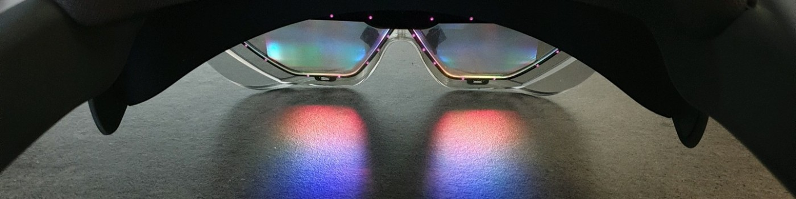
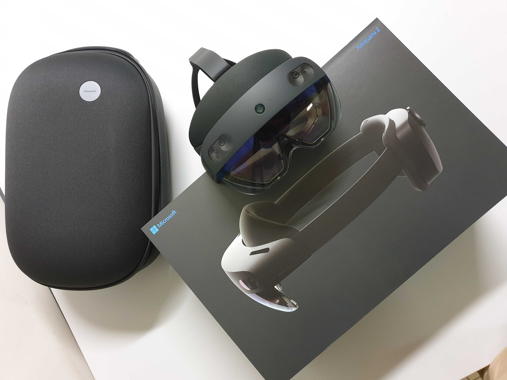
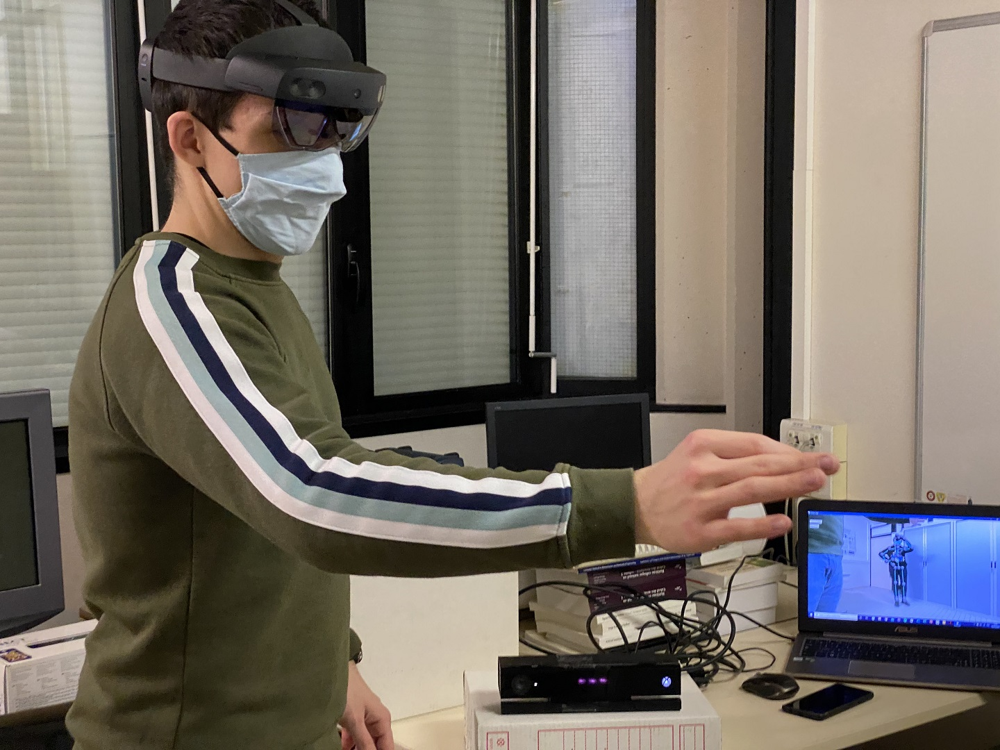
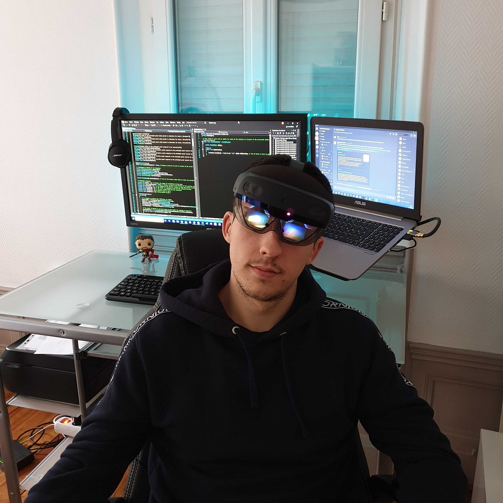
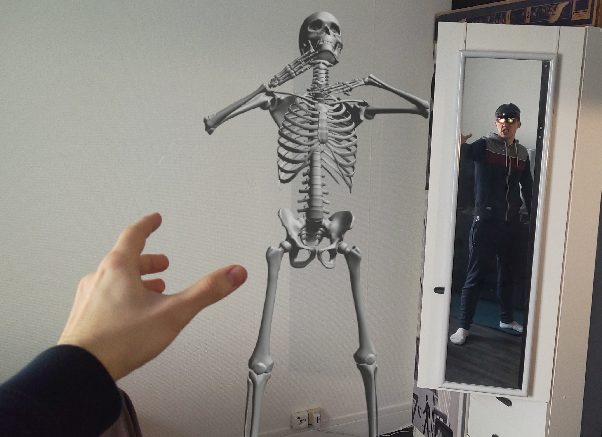
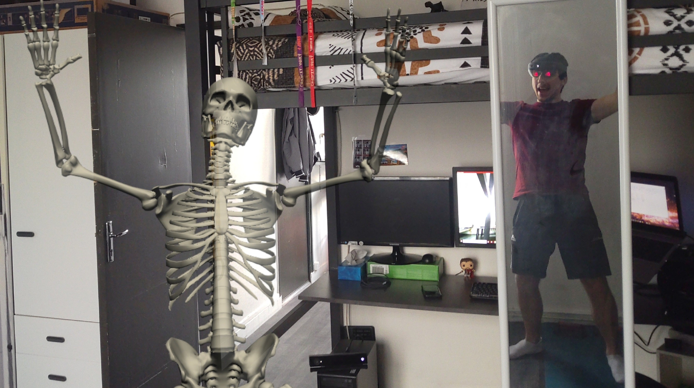

# Assistant engineer internship : HoloLens and Mixed Reality are incredible 🤯

## The project 🚀
This project was coordinated by the Biomechanics and Bioengineering laboratory (BMBI) of UTC's center of research (University of technology of Compiègne, my engineering school).
The long-time goal of this project is to propose a reliable platform to diagnose post covid-19 sequelae for healed patients. Those sequelae can be functional such as muscles atrophy or articulations pain, or cognitive such as the pursue of the loss of the sense of smell or panic crisis. This platform is to be used on a HoloLens 2 by doctors. It aims to track and collect data about patients when they are doing some actions and exercises. Like that, a diagnosis can be proposed.

My job on this project was to develop the very first prototype of this platform, focusing on the functional sequelae. In that way, I had to pair a Kinect V2 and a HoloLens 2 to share the body data of the patient. The body is tracked by the camera with a PC application and sent to the helmet's application. Once the data is received, it is used to animate a holographic skeleton which reproduces the patient's movements. Finally, we ask the patient to do some exercise like squats to study the relevant and typical angles of the movement. A grade from A to C is then given to express the patient's form and capacity to move correctly.

Unfortunately, because of the second lockdown in France, this internship has been mostly done in remote work. Because of the restructured internal organisation, I was the only daily worker on this project, with some meetings to present my progress and receive some instructions.

## What I learned 🌟
During this internship, I (obviously) learned to **use a HoloLens and a Kinect**. I also understood the principles behind their technology.
But above all, this project allowed me to make **my first steps with the Unity game engine**. I used this engine both for the Kinect and HoloLens apps. This is one of the points that I enjoyed the most because as I want to be a game developer, I needed a great springboard to start using game dev tools. I have also been confronted to **online issues** due to the need of communication between the HoloLens and the Kinect.  

Besides, it also allowed me to **work totally on my own** on a project. It seemed complicated and scary at the beginning, because of the new technologies and softwares I had to use, but with time and a short period of adaptation it went totally fine and cool !

You can take a look to my [internship report](Assets/Internship%20report%20(french).pdf) if you want ! (written in French, English version coming soon)

## Gallery 🖼️
Since the HoloLens enables to take screenshots and videos of what we see through its lens, I took some funny pictures of me and my skeletal friend ! (not during work hours I promise ! 😬)

|||
:-------------------------:|:-------------------------:
|When we received it, it was christmas at the lab !!|The first try of the helmet was impressive|

|||
:-------------------------:|:-------------------------:
|I am not a white dragon but I have beautiful blue eyes|Who are you ?! What are you doing on my sofa ??|

|||
:-------------------------:|:-------------------------:
|The Force is strong in this one...|Hey my friend ! It's been a while !!|

## Demo video 🎥
Here is a link to the demonstration video I showed the jury during my internship presentation.  

