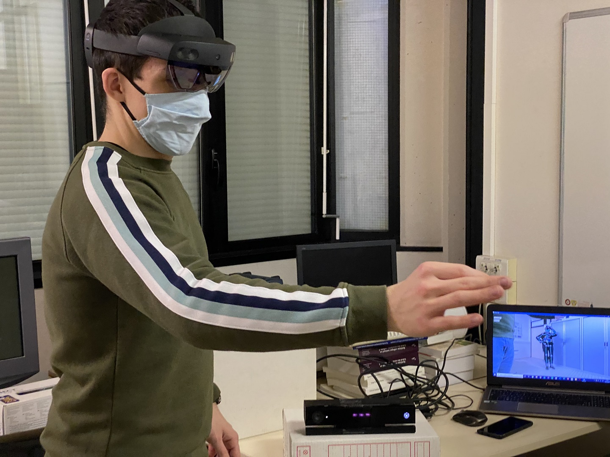
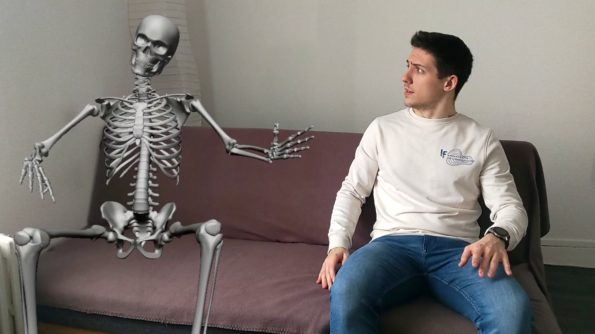
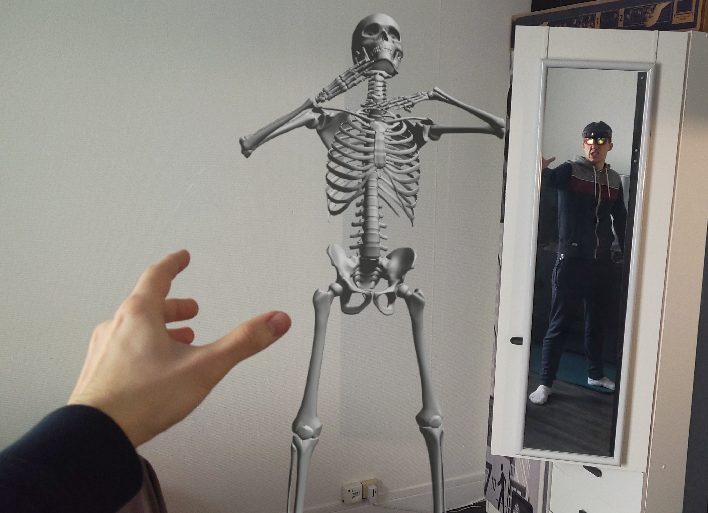
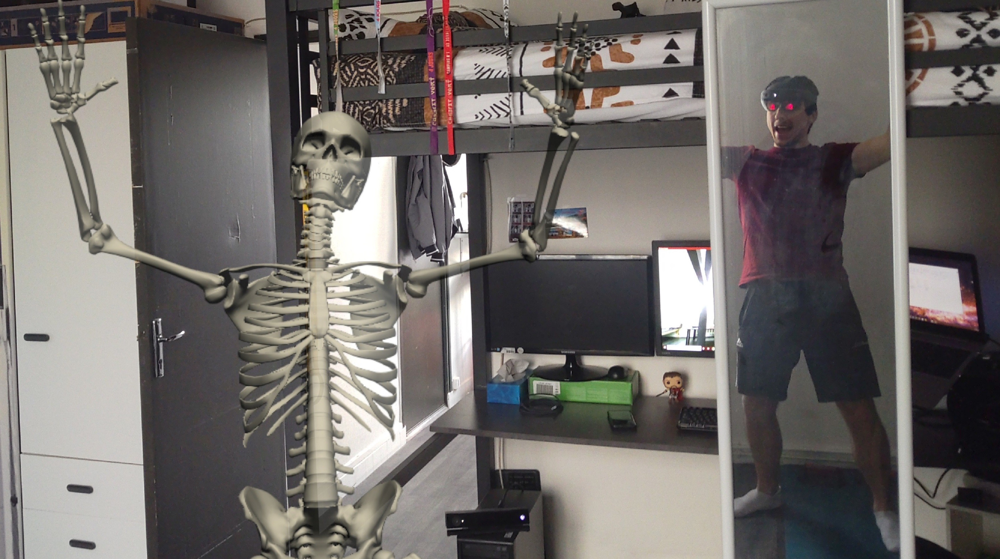

# Assistant engineer internship : HoloLens and MR are incredible

  

## The project
TODO: explanation of the project

## Gallery
Since the HoloLens enables to take screenshots and videos of what we see through its lens, I took some funny pictures of me and my skeletal friend ! (not during work hours of course 😬)

### Pictures
|||
:-------------------------:|:-------------------------:
|HoloLens 2 is such an amazing technology|Who are you ?! Why are you on my sofa ??|

|||
:-------------------------:|:-------------------------:
|The Force is strong in this one...|Hey my friend ! It's been a while !!|

### Videos

